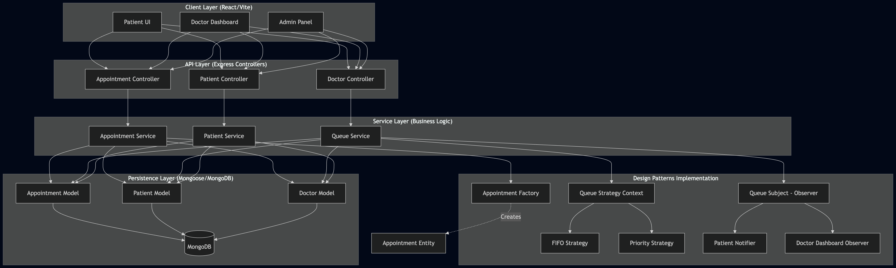
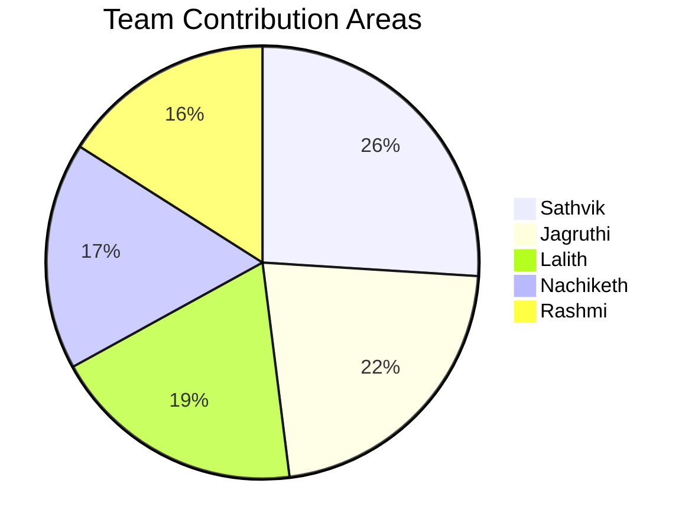

# MediQueue

[](https://www.typescriptlang.org/)
[](./client)
[](./server)
[](./server/src/models)

MediQueue is a smart hospital queue and appointment management system focused on digitizing appointment booking, queue handling, consultation flow, and hospital-side coordination.

The core idea of the project is simple: replace fragmented manual hospital workflows with a structured digital system that is easier to manage, easier to extend, and easier to reason about in code.

At the current stage of the repository, the backend is the strongest and most important part of the implementation.

## Table of Contents

- [Project Idea](#project-idea)
- [Actors and Use Cases](#actors-and-use-cases)
- [Current Project State](#current-project-state)
- [Tech Stack](#tech-stack)
- [Repository Structure](#repository-structure)
- [Backend Architecture](#backend-architecture)
- [Implemented Design Patterns](#implemented-design-patterns)
- [Data Models](#data-models)
- [Getting Started](#getting-started)
- [Available Commands](#available-commands)
- [Environment Variables](#environment-variables)
- [Project Diagrams](#project-diagrams)
- [Roadmap](#roadmap)

## Project Idea

MediQueue models a hospital workflow around three primary actors:

- `Patient`
- `Doctor`
- `Admin`

The system is intended to support booking, queue visibility, consultation handling, notifications, patient history, doctor availability, and admin-side operational control.

This project is not just about storing data. It is designed around domain entities, interfaces, reusable types, design patterns, and MongoDB models so that the hospital workflow is represented clearly in the codebase.

## System Architecture

<p align="center">
  
</p>

## Actors and Use Cases

## System Roles & Functionalities

| Patient | Doctor | Admin |
|--------|--------|-------|
| Register and login | Set availability | Add or remove doctors |
| Select doctor & time slot | Block time (breaks/emergencies) | Configure consultation rules & hours |
| Book appointments | View today's queue | View system overview |
| View queue position | Call next patient | Handle scheduling conflicts |
| Receive notifications | View patient details | Override appointment cancellations |
| Reschedule appointments | Write prescriptions |  |
| Cancel appointments | Recommend follow-ups |  |
| View appointment history | Mark consultation complete |  |
|  | Review patient history |  |
|  | Flag critical cases |  |

## Current Project State

The repository currently has a much stronger backend foundation than frontend product implementation.

### Implemented

- Express server bootstrap
- MongoDB connection setup with Mongoose
- Domain entities for users and appointments
- Interfaces for users, appointments, queue flow, and notifications
- Shared enums and reusable system types
- Design pattern implementations for queue handling, notifications, and appointment creation
- MongoDB models for the main hospital data objects
- UML and system analysis diagrams

### Still in Progress

- Frontend is still an early React and Vite shell
- API routes, controllers, and services are not fully implemented yet
- Authentication flow is not fully built in the current codebase
- End-to-end workflows are modeled in code but not yet exposed through a complete application flow

## Tech Stack

| Frontend        | Backend        |
|:----------------|:---------------|
| React           | Node.js        |
| TypeScript      | Express        |
| Vite            | TypeScript     |
| Axios           | MongoDB        |
| ESLint          | Mongoose       |

### Design

- Object-oriented design
- SOLID-oriented structure
- UML diagrams
- Use case modeling
- ER modeling
- design-pattern-based backend architecture

## Repository Structure

```text
MediQueue/
├── client/        # React + Vite frontend
├── server/        # Express + TypeScript backend
├── diagrams/      # Use case, class, sequence, and ER diagrams
└── README.md
```

### Frontend

The frontend lives in [`client`](./client). It is currently a lightweight React + Vite setup and should be treated as the starting shell for the future hospital interface.

### Backend

The backend lives in [`server`](./server). This is the most developed part of the current project and contains the domain model, queue behavior, design patterns, and MongoDB model layer.

## Backend Architecture

The backend is organized to keep domain logic, contracts, persistence, and reusable behavior clearly separated.

```text
server/src/
├── config/       # MongoDB connection setup
├── entities/     # Core hospital domain classes
├── interfaces/   # Contracts for users, appointments, queue, and notifications
├── models/       # MongoDB Mongoose schemas
├── patterns/     # Design pattern implementations
├── types/        # Shared enums and reusable types
└── index.ts      # Express server entry point
```

### Entities

Implemented in [`server/src/entities`](./server/src/entities):

| Entity | Role in the System |
| --- | --- |
| `User` | Base user abstraction for the system |
| `Patient` | Represents patient-specific information and behavior |
| `Doctor` | Represents doctor-specific information, availability, and consultation behavior |
| `Admin` | Represents administrative users and system-level control |
| `Appointment` | Base abstraction for appointment flow |
| `WalkInAppointment` | Appointment type for walk-in visits |
| `ScheduledAppointment` | Appointment type for scheduled visits |
| `EmergencyAppointment` | Appointment type for emergency visits |

These classes represent the business side of the system before persistence concerns are applied.

### Interfaces

Implemented in [`server/src/interfaces`](./server/src/interfaces):

| Interface | Responsibility |
| --- | --- |
| `user_interface` | Defines the common structure for system users |
| `patient_interface` | Defines patient-specific fields and behavior |
| `doctor_interface` | Defines doctor-specific fields and behavior |
| `admin_interface` | Defines admin-specific fields and system actions |
| `appointment_interface` | Defines the contract for appointment objects |
| `queue_observer_interface` | Defines how queue observers receive updates |
| `queue_subject_interface` | Defines how queue subjects manage observers |
| `queue_strategy_interface` | Defines the contract for queue ordering strategies |
| `notification_interface` | Defines the contract for notification channels |

These contracts keep the backend modular and easier to extend.

### Shared Types

Defined in [`server/src/types/system.types.ts`](./server/src/types/system.types.ts):

| Type Group | Purpose |
| --- | --- |
| User roles | Distinguish patient, doctor, and admin users |
| Appointment types | Distinguish walk-in, scheduled, and emergency appointments |
| Appointment statuses | Track the appointment lifecycle |
| Queue entry statuses | Track patient state inside the queue |
| Doctor availability states | Track doctor availability and working condition |
| Notification types | Categorize notification events |
| Case priorities | Support emergency and priority-based handling |
| Time slots | Represent appointment and availability time windows |
| Queue entries and queue snapshots | Represent live queue state |
| Prescription and follow-up structures | Represent treatment output after consultation |
| Daily summary structure | Represent doctor-level summary data |

## Implemented Design Patterns

The backend is one of the strongest parts of the repository because it already applies multiple design patterns that fit the hospital queue and appointment domain.

**Factory Pattern**  
File: [`server/src/patterns/appointment_factory.ts`](./server/src/patterns/appointment_factory.ts)  
Purpose: Create the correct appointment object based on appointment type without spreading conditional creation logic  
Main classes: `WalkInFactory`, `ScheduledFactory`, `EmergencyFactory`, `AppointmentFactoryProvider`

**Strategy Pattern**  
File: [`server/src/patterns/queue_strategy.ts`](./server/src/patterns/queue_strategy.ts)  
Purpose: Allow queue ordering rules to change without rewriting queue manager logic  
Main classes: `FIFOQueueStrategy`, `PriorityQueueStrategy`, `RoundRobinQueueStrategy`

**Observer Pattern**  
File: [`server/src/patterns/queue_manager.ts`](./server/src/patterns/queue_manager.ts), [`server/src/patterns/queue_observer.ts`](./server/src/patterns/queue_observer.ts)  
Purpose: Notify observers when queue state changes while keeping queue logic decoupled  
Main classes: `QueueManager`, `PatientQueueObserver`, `DoctorQueueObserver`

**Singleton Pattern**  
File: [`server/src/patterns/queue_registry.ts`](./server/src/patterns/queue_registry.ts)  
Purpose: Maintain one shared registry of doctor queues across the application  
Main classes: `QueueRegistry`

**Adapter Pattern**  
File: [`server/src/patterns/notification_adapter.ts`](./server/src/patterns/notification_adapter.ts)  
Purpose: Normalize different notification providers behind one application-facing contract  
Main classes: `EmailAdapter`, `SmsAdapter`, `PushAdapter`

**Composite Pattern**  
File: [`server/src/patterns/notification_composite.ts`](./server/src/patterns/notification_composite.ts)  
Purpose: Send one notification event through multiple channels as a grouped action  
Main classes: `NotificationGroup`

## Data Models

The MongoDB persistence layer lives in [`server/src/models`](./server/src/models).

**User Model**  
File: [`server/src/models/user_model.ts`](./server/src/models/user_model.ts)  
Main responsibility: Store patient, doctor, and admin data in one role-based collection  
Covers: user profiles, doctor availability, admin doctor management

**Appointment Model**  
File: [`server/src/models/appointment_model.ts`](./server/src/models/appointment_model.ts)  
Main responsibility: Store appointment lifecycle and queue mapping  
Covers: scheduled, walk-in, emergency, status, reschedule, cancellation, critical cases

**Queue Model**  
File: [`server/src/models/queue_model.ts`](./server/src/models/queue_model.ts)  
Main responsibility: Store per-doctor queue state and queue entries  
Covers: daily queue snapshots, token order, patient queue status

**Notification Model**  
File: [`server/src/models/notification_model.ts`](./server/src/models/notification_model.ts)  
Main responsibility: Store notification history for users  
Covers: queue updates, reminders, follow-ups, read or unread state

**Medical Record Model**  
File: [`server/src/models/medical_record_model.ts`](./server/src/models/medical_record_model.ts)  
Main responsibility: Store consultation history and clinical follow-up data  
Covers: diagnosis, notes, prescriptions, follow-ups, critical marking

**System Setting Model**  
File: [`server/src/models/system_setting_model.ts`](./server/src/models/system_setting_model.ts)  
Main responsibility: Store system-wide operational rules  
Covers: consultation duration, working hours, queue defaults, appointment rules

## Getting Started

### Prerequisites

- Node.js
- npm
- MongoDB local instance or MongoDB Atlas connection

### Clone the Repository

```bash
git clone <your-repository-url>
cd MediQueue
```

### Install Dependencies

Client:

```bash
cd client
npm install
```

Server:

```bash
cd server
npm install
```

## Available Commands

| Workspace | Command | Purpose |
| --- | --- | --- |
| `server` | `npm run dev` | Run the backend in development mode |
| `server` | `npm run build` | Compile the backend TypeScript output |
| `server` | `npm run typecheck` | Run backend TypeScript checks without emitting files |
| `client` | `npm run dev` | Run the frontend in development mode |
| `client` | `npm run build` | Build the frontend project |
| `client` | `npm run lint` | Run frontend lint checks |
| `client` | `npm run preview` | Preview the built frontend locally |

## Environment Variables

Create a `.env` file inside `server/src`.

Example:

```env
PORT=5000
MONGO_URI=your_mongodb_connection_string
```

## Project Diagrams

The repository includes supporting diagrams for system understanding and documentation:

- use case diagrams in [`diagrams/usecase`](./diagrams/usecase)
- class diagrams in [`diagrams/class`](./diagrams/class)
- sequence diagrams in [`diagrams/sequence`](./diagrams/sequence)
- ER diagrams in [`diagrams/er_diagram`](./diagrams/er_diagram)

## Roadmap

Possible next steps for the project include:

- complete API route and controller layers
- connect the frontend to real backend workflows
- build authentication and authorization flows
- add validation and error handling layers
- implement admin system overview analytics
- integrate real notification providers
- expand queue and scheduling conflict resolution logic

## Team Contributions



<details>
<summary><strong>Sathvik</strong></summary>

Led the overall system design, defined interfaces and entities, applied design patterns, set up the development code structure and project architecture, worked on use case diagram version 2, and supported backend and frontend implementation flow and connections.

</details>

<details>
<summary><strong>Jagruthi</strong></summary>

Managed database configuration, identified models and schemas, prepared project documentation including the README, contributed to frontend and backend development, and worked on use case diagrams.

</details>

<details>
<summary><strong>Lalith</strong></summary>

Worked on design patterns, ER diagrams, backend integration, and implementation support.

</details>

<details>
<summary><strong>Nachiketh</strong></summary>

Responsible for database modeling, class diagrams, frontend development, and backend support.

</details>

<details>
<summary><strong>Rashmi</strong></summary>

Created sequence diagrams, worked on entities, and supported both frontend and backend development.

</details>

## Conclusion

MediQueue already has a meaningful backend foundation for a hospital queue and appointment management system. Its clearest strength today is the backend architecture: the domain entities, shared contracts, pattern-based queue logic, and MongoDB model layer create a solid base for future API and product development.
