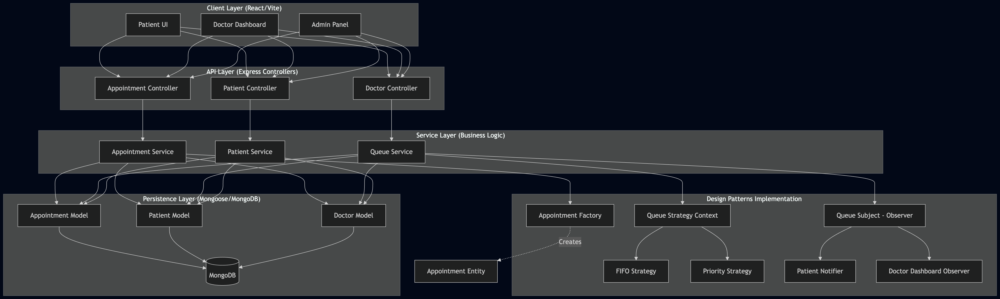

# MediQueue: Smart Hospital Queue & Appointment Management System
## Project Overview

MediQueue is a real-world hospital queue management system designed to digitize patient registration, appointment scheduling, and real-time queue tracking. The system addresses a critical problem in healthcare—long waiting times, inefficient manual token systems, and lack of visibility for both patients and doctors.

The platform enables patients to seamlessly book appointments, track their live queue position, and receive timely notifications. Doctors are provided with a dedicated dashboard to efficiently manage patient flow, consultations, and workload.

The system is built using modern web technologies and follows strong software engineering principles including Object-Oriented Programming (OOP), all five SOLID principles, and key design patterns such as Observer, Strategy, and Factory.


<<<<<<< HEAD
=======
- [Project Idea](#project-idea)
- [Core Use Cases](#core-use-cases)
- [Current Project State](#current-project-state)
- [Tech Stack](#tech-stack)
- [Repository Structure](#repository-structure)
- [Backend Architecture](#backend-architecture)
- [Implemented Design Patterns](#implemented-design-patterns)
>>>>>>> 3e0efac (document backend architecture and design patterns)

## Key Features

### Patient Module

* Register and login securely (JWT-based authentication)
* Book, reschedule, or cancel appointments
* View available doctors and time slots
* Track real-time queue position
* Receive live notifications for queue updates
* Access appointment history

### Doctor Module

* Manage availability and block time slots
* View and manage daily patient queue
* Call next patient with automated notifications
* Access patient details and medical history
* Write prescriptions and recommend follow-ups
* Mark consultations complete and update queue dynamically
* Handle emergency cases with priority override

### Admin Module

* Manage doctors (add/update/remove)
* Configure system-wide settings (timings, slot duration)
* View system analytics and operational overview


## Core System Workflows

### 1. Appointment Booking Flow

1. Patient selects a doctor
2. System fetches available time slots
3. Patient selects a slot and confirms booking
4. System assigns queue number and stores appointment

### 2. Live Queue & Consultation Flow

1. Doctor views today's queue
2. Doctor calls next patient
3. System sends notifications to patients
4. Doctor performs consultation and writes prescription
5. System updates queue and recalculates positions


## Tech Stack

### Frontend

* React.js
* TypeScript
* HTML, CSS

### Backend

* Node.js
* Express.js
* TypeScript

### Database

* MongoDB (Mongoose)

### Tools & Technologies

* JWT Authentication
* WebSockets / Real-time Notifications
* REST APIs
* Git & GitHub


## 📂 Project Structure

```
MediQueue/
├── client/                  → React + TypeScript (Frontend)
│   ├── public/
│   ├── src/
│   │   ├── assets/
│   │   ├── components/
│   │   ├── pages/
│   │   ├── hooks/
│   │   ├── services/
│   │   ├── types/
│   │   └── utils/
│
├── server/                  → Node.js + Express + TypeScript (Backend)
│   ├── src/
│   │   ├── config/
│   │   ├── controllers/
│   │   ├── models/
│   │   ├── routes/
│   │   ├── services/
│   │   ├── patterns/
│   │   ├── interfaces/
│   │   └── utils/
│
├── docs/                    → Project documentation
├── diagrams/                → UML diagrams
├── db/                      → Schema and ER diagrams
└── README.md
```


## Database Design

<<<<<<< HEAD
### Collections:

* **Users** – Handles authentication and roles (Patient, Doctor, Admin)
* **DoctorSchedules** – Stores availability and blocked time slots
* **Appointments** – Core queue and booking data
* **MedicalRecords** – Prescriptions, diagnosis, and history
* **SystemSettings** – Global configuration


## Architecture




## Design Principles & Patterns

### SOLID Principles

* **Single Responsibility Principle** – Separate services for authentication, appointments, notifications
* **Open/Closed Principle** – Easy to extend (e.g., adding new notification channels)
* **Liskov Substitution Principle** – Flexible role-based architecture
* **Interface Segregation Principle** – Clean separation of interfaces
* **Dependency Inversion Principle** – Services depend on abstractions

### Design Patterns

* **Observer Pattern**
  Used for real-time queue updates and notifications

* **Strategy Pattern**
  Enables flexible queue handling (FIFO, priority-based)

* **Factory Pattern**
  Used for scalable creation of appointment types


## Setup & Installation

### Prerequisites

* Node.js installed
* MongoDB installed or cloud instance (MongoDB Atlas)
* Git installed

### Clone the Repository

```
git clone https://github.com/your-username/MediQueue.git
cd MediQueue
```


## ▶️ Running the Project

### Backend Setup

```
cd server
npm install
npm run dev
```

### Frontend Setup

```
cd client
npm install
npm start
```


## Environment Variables

Create a `.env` file in the server directory:

```
PORT=5000
MONGO_URI=your_mongodb_connection_string
JWT_SECRET=your_secret_key
```


## Scalability & Future Scope

* Load balancing across multiple doctors
* Caching for queue prediction and wait time estimation
* Integration with SMS/WhatsApp notifications
* Multi-hospital support
* AI-based patient prioritization


## 👥 Team Members & Contributions

| Name                | Contribution                                                                 |
|---------------------|------------------------------------------------------------------------------|
| Koriginja Sathvik   | Led system design, developed the complete codebase, and defined overall architecture |
| Pulumati Jagruthi   | Created system diagrams(usecase & class), managed GitHub repository, and designed interfaces  |
| Rashmi Anand        | Worked on system diagrams(ER & sequence) and defined entity structures within the codebase  |
| Kasula Lalithendra  | Contributed to development tasks and supported implementation across modules |
| Nachiket            | Assisted in development, integration, and overall project support            |


## 📄 License

This project is developed for academic and learning purposes.


##  Conclusion

MediQueue provides a scalable and efficient solution to modernize hospital queue systems. By combining real-time updates, structured appointment handling, and strong architectural principles, it significantly improves both patient experience and hospital efficiency.
=======
The backend lives in [server](/Users/jagruthipulumati/Desktop/sd/MediQueue/server) and contains the architectural core of the project. This is where the hospital domain, queue behavior, design patterns, and MongoDB model definitions are currently concentrated.

## Backend Architecture

The backend is the center of the current implementation. It is organized to separate domain modeling, contracts, persistence, and reusable behavioral logic in a way that is easier to extend as the product grows.

```text
server/src/
├── config/       # MongoDB connection setup
├── entities/     # Core hospital domain classes
├── interfaces/   # Contracts for appointments, queue, users, and notifications
├── models/       # MongoDB Mongoose schemas
├── patterns/     # Design pattern implementations
├── types/        # Shared enums and reusable types
└── index.ts      # Express server entry point
```

### Entities

The entity layer captures the core business objects used to model hospital operations.

Implemented entities:
- `User`
- `Patient`
- `Doctor`
- `Admin`
- `Appointment`
- `WalkInAppointment`
- `ScheduledAppointment`
- `EmergencyAppointment`

These live in [server/src/entities](/Users/jagruthipulumati/Desktop/sd/MediQueue/server/src/entities) and represent the business side of the system before database persistence is applied.

### Interfaces

The interface layer defines the contracts that shape queue management, notification delivery, appointments, and user roles.

Implemented interfaces:
- user interface
- patient interface
- doctor interface
- admin interface
- appointment interface
- queue observer interface
- queue subject interface
- queue strategy interface
- notification channel interface

These live in [server/src/interfaces](/Users/jagruthipulumati/Desktop/sd/MediQueue/server/src/interfaces) and help keep the backend modular and easier to evolve.

### Shared Types

The shared types file in [server/src/types/system.types.ts](/Users/jagruthipulumati/Desktop/sd/MediQueue/server/src/types/system.types.ts) contains the enums and reusable value types that connect the rest of the backend.

It currently defines:
- user roles
- appointment types
- appointment statuses
- queue entry statuses
- doctor availability states
- notification types
- case priorities
- time slots
- queue entries and queue snapshots
- prescription and follow-up structures
- doctor daily summary structure

## Implemented Design Patterns

One of the strongest aspects of the project is that the backend is already modeled using design patterns that fit the hospital queue and appointment domain.

### Factory Pattern

Implemented in [server/src/patterns/appointment_factory.ts](/Users/jagruthipulumati/Desktop/sd/MediQueue/server/src/patterns/appointment_factory.ts).

This pattern is used to create the correct appointment object without spreading appointment type checks throughout the application.

Included classes:
- `WalkInFactory`
- `ScheduledFactory`
- `EmergencyFactory`
- `AppointmentFactoryProvider`

### Strategy Pattern

Implemented in [server/src/patterns/queue_strategy.ts](/Users/jagruthipulumati/Desktop/sd/MediQueue/server/src/patterns/queue_strategy.ts).

This pattern is used to support multiple queue ordering rules while keeping queue management logic independent from sorting behavior.

Included strategies:
- `FIFOQueueStrategy`
- `PriorityQueueStrategy`
- `RoundRobinQueueStrategy`

### Observer Pattern

Implemented in [server/src/patterns/queue_manager.ts](/Users/jagruthipulumati/Desktop/sd/MediQueue/server/src/patterns/queue_manager.ts) and [server/src/patterns/queue_observer.ts](/Users/jagruthipulumati/Desktop/sd/MediQueue/server/src/patterns/queue_observer.ts).

This pattern is used to notify interested listeners when queue state changes.

Included classes:
- `QueueManager`
- `PatientQueueObserver`
- `DoctorQueueObserver`

### Singleton Pattern

Implemented in [server/src/patterns/queue_registry.ts](/Users/jagruthipulumati/Desktop/sd/MediQueue/server/src/patterns/queue_registry.ts).

This pattern is used to maintain a single shared queue registry across the system.

Included class:
- `QueueRegistry`

### Adapter Pattern

Implemented in [server/src/patterns/notification_adapter.ts](/Users/jagruthipulumati/Desktop/sd/MediQueue/server/src/patterns/notification_adapter.ts).

This pattern is used to normalize different notification providers under one application-facing interface.

Included adapters:
- `EmailAdapter`
- `SmsAdapter`
- `PushAdapter`

### Composite Pattern

Implemented in [server/src/patterns/notification_composite.ts](/Users/jagruthipulumati/Desktop/sd/MediQueue/server/src/patterns/notification_composite.ts).

This pattern is used to send one notification event through multiple channels as a single grouped action.

Included class:
- `NotificationGroup`
>>>>>>> 3e0efac (document backend architecture and design patterns)
