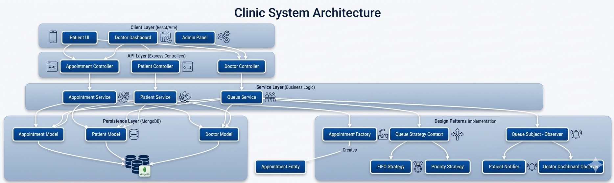

# MediQueue

[](https://www.typescriptlang.org/)
[](./client)
[](./server)
[](./server/src/models)

MediQueue is a hospital queue and appointment management system that helps patients book appointments, doctors manage consultations, and hospital administrators monitor operational workflows from one digital platform.

The project is built around three main roles: patients, doctors, and admins. Patients can register, log in, browse doctors, book or cancel appointments, and view queue status. Doctors can view their queue, update availability, call the next patient, complete consultations, and record prescriptions or follow-ups. Admin-facing UI components support doctor management, patient visibility, system statistics, and conflict resolution workflows.

## Table of Contents

- [Project Overview](#project-overview)
- [Tech Stack](#tech-stack)
- [Live Deployment](#live-deployment)
- [Setup and Installation](#setup-and-installation)
- [How to Run the Project](#how-to-run-the-project)
- [Testing](#testing)
- [Architecture](#architecture)
- [Backend Modules](#backend-modules)
- [Frontend Modules](#frontend-modules)
- [API Flow](#api-flow)
- [Design Patterns](#design-patterns)
- [Database Models](#database-models)
- [Project Structure](#project-structure)
- [Diagrams](#diagrams)
- [Team Contributions](#team-contributions)

## Project Overview

MediQueue replaces manual hospital queue handling with a structured digital workflow:

| Role    | Main Functionalities                                                                                                                                   |
| ------- | ------------------------------------------------------------------------------------------------------------------------------------------------------ |
| Patient | Register/login, browse doctors, book appointments, cancel appointments, view appointment history, track queue position                                 |
| Doctor  | View today's queue, update queue strategy, change availability status, call next patient, complete consultation, create prescription/follow-up records |
| Admin   | View system dashboard, manage doctors, inspect patients, monitor stats, review scheduling conflicts                                                    |

The application separates the user interface, API layer, domain entities, database models, and reusable design-pattern logic so the hospital workflow remains easy to understand and extend.

## Tech Stack

| Layer             | Technologies                                                                                  |
| ----------------- | --------------------------------------------------------------------------------------------- |
| Frontend          | React 19, TypeScript, Vite, React Router, Axios, Framer Motion, Lucide React, React Hot Toast |
| Backend           | Node.js, Express 5, TypeScript, tsx, nodemon                                                  |
| Database          | MongoDB, Mongoose                                                                             |
| Authentication    | JWT, bcrypt                                                                                   |
| API Tools         | CORS, Morgan, dotenv                                                                          |
| Development Tools | npm, ESLint, TypeScript compiler                                                              |
| Deployment Config | Vercel config for client, Render config for backend/project deployment                        |

## Live Deployment

| Service     | URL                                                                          |
| ----------- | ---------------------------------------------------------------------------- |
| Frontend    | [https://medi-queue-indol.vercel.app/](https://medi-queue-indol.vercel.app/) |
| Backend API | [https://mediqueue-8ofq.onrender.com](https://mediqueue-8ofq.onrender.com)   |

## Setup and Installation

### Prerequisites

- Node.js and npm
- MongoDB running locally or a MongoDB Atlas connection string
- Git

### Clone the Repository

```bash
git clone <your-repository-url>
cd MediQueue
```

### Install Backend Dependencies

```bash
cd server
npm install
```

### Install Frontend Dependencies

```bash
cd ../client
npm install
```

### Configure Environment Variables

Create a `.env` file inside the `server` folder:

```env
PORT=5000
MONGO_URI=mongodb://localhost:27017/mediqueue
JWT_SECRET=replace_with_a_secure_secret
NODE_ENV=development
```

For a MongoDB Atlas database, replace `MONGO_URI` with your Atlas connection string.

Optional frontend environment variable:

```env
VITE_API_URL=http://localhost:5000/api
```

When running through Vite locally, this is optional because `client/vite.config.ts` proxies `/api` requests to `http://localhost:5000`.

## How to Run the Project

Run the backend server first:

```bash
cd server
npm run dev
```

The Express API runs on:

```text
http://localhost:5000
```

In a second terminal, run the frontend:

```bash
cd client
npm run dev
```

The React app runs on:

```text
http://localhost:5173
```

### Useful Commands

| Folder   | Command             | Description                                     |
| -------- | ------------------- | ----------------------------------------------- |
| `server` | `npm run dev`       | Start the backend in development mode           |
| `server` | `npm run build`     | Compile TypeScript into `dist`                  |
| `server` | `npm run typecheck` | Check backend TypeScript without emitting files |
| `server` | `npm run start`     | Run the compiled backend from `dist/index.js`   |
| `client` | `npm run dev`       | Start the Vite frontend                         |
| `client` | `npm run build`     | Build the production frontend                   |
| `client` | `npm run lint`      | Run frontend lint checks                        |
| `client` | `npm run preview`   | Preview the production build locally            |

### Seed Sample Doctors

The backend includes a seed script at `server/src/seed.ts` for adding sample doctors. It is not currently exposed as an npm script, but it can be run with `tsx` after backend dependencies are installed:

```bash
cd server
npx tsx src/seed.ts
```

## Testing

The automated backend tests are available in `server/tests`. These tests use Node's built-in test runner through `tsx`, so they can run TypeScript test files directly. The tests mock Mongoose model calls, which keeps them fast and allows the controller logic to be checked without starting Express or connecting to MongoDB.

Run the tests:

```bash
cd server
npm test
```

Current verified result:

```text
tests 15
pass 15
fail 0
```

### Test Files

| Test File                                  | What It Tests                                                                                                                                                                                                                                             |
| ------------------------------------------ | --------------------------------------------------------------------------------------------------------------------------------------------------------------------------------------------------------------------------------------------------------- |
| `server/tests/appointment_factory.test.ts` | Verifies that `AppointmentFactoryProvider` returns the correct factory for walk-in, scheduled, and emergency appointments. It also checks that scheduled appointments default to normal priority and emergency appointments default to critical priority. |
| `server/tests/auth_middleware.test.ts`     | Verifies authentication and role-authorization behavior. It checks that missing bearer tokens are rejected, valid JWTs attach the authenticated user to the request, and incorrect roles receive a forbidden response.                                    |
| `server/tests/patient_controller.test.ts`  | Verifies patient appointment flows. It checks booking today's appointment, adding the appointment to the queue, assigning a token number, cancelling an appointment, removing it from the queue, and calculating queue status.                           |
| `server/tests/doctor_controller.test.ts`   | Verifies doctor workflow behavior. It checks that the doctor queue is formatted for the dashboard and that consultation completion updates the appointment, queue entry, and medical record.                                                              |
| `server/tests/queue_strategy.test.ts`      | Verifies queue ordering rules. It checks FIFO ordering by check-in time, priority ordering by case severity, priority tie-breaking by check-in time, and round-robin rotation across repeated calls.                                                      |
| `server/tests/helpers/mock_response.ts`    | Provides a lightweight mock Express response object used by controller and middleware tests.                                                                                                                                                              |
| `server/tests/README.md`                   | Documents the backend test cases, expected results, current pass/fail status, and possible future testing improvements.                                                                                                                                   |

### Test Coverage Summary

| Area | Covered Scenarios |
| --- | --- |
| Appointment creation | Factory selection, scheduled appointment defaults, emergency appointment defaults |
| Authentication | Missing bearer token, valid JWT handling, request user attachment |
| Authorization | Allowed role passes, incorrect role receives forbidden response |
| Patient workflow | Appointment booking, queue token assignment, appointment cancellation, queue removal, queue status calculation |
| Doctor workflow | Queue formatting, consultation completion, medical record creation |
| Queue logic | FIFO ordering, priority ordering, priority tie-breaking, round-robin rotation |

## Architecture



MediQueue follows a client-server architecture:

1. The React frontend provides separate views for landing, login, registration, patient dashboard, doctor dashboard, and admin dashboard.
2. The frontend service layer uses Axios to send requests to the backend API.
3. The Express backend exposes authentication, patient, and doctor routes.
4. Middleware validates JWT tokens and applies role-based access control.
5. Controllers process user actions such as login, appointment booking, queue lookup, doctor status updates, and consultation completion.
6. Mongoose models persist users, appointments, queues, notifications, medical records, and system settings in MongoDB.
7. Domain entities, interfaces, and design patterns organize the business rules for appointments, queues, notifications, and role behavior.

## Backend Modules

```text
server/src/
├── config/        # MongoDB connection
├── controllers/   # Request handlers for auth, patient, and doctor flows
├── entities/      # Domain classes for users and appointments
├── interfaces/    # Contracts for users, queues, appointments, and notifications
├── middlewares/   # JWT authentication and role authorization
├── models/        # Mongoose schemas and database models
├── patterns/      # Factory, strategy, observer, singleton, adapter, and composite logic
├── routes/        # Express route definitions
├── types/         # Shared enums and reusable system types
├── index.ts       # Express app entry point
└── seed.ts        # Sample doctor seeding script
```

Main backend route groups:

| Route Group    | Purpose                                                                                                 |
| -------------- | ------------------------------------------------------------------------------------------------------- |
| `/api/auth`    | Register, login, and fetch the current authenticated user                                               |
| `/api/patient` | List doctors, book appointments, view appointments, cancel appointments, and check queue status         |
| `/api/doctor`  | View queue, update strategy/status, call next patient, complete consultation, and view workload summary |

## Frontend Modules

```text
client/src/
├── components/    # Shared UI plus patient, doctor, and admin components
├── context/       # Authentication context
├── hooks/         # Reusable React hooks
├── layouts/       # Auth and dashboard layouts
├── pages/         # Landing, login, register, and role dashboards
├── services/      # Axios API services
├── types/         # Frontend TypeScript types
├── utils/         # Token/session helpers
├── App.tsx        # Application routes
└── main.tsx       # React entry point
```

Frontend routes:

| Route        | Page              |
| ------------ | ----------------- |
| `/`          | Landing page      |
| `/login`     | Login page        |
| `/register`  | Registration page |
| `/dashboard` | Patient dashboard |
| `/doctor`    | Doctor dashboard  |
| `/admin`     | Admin dashboard   |

## API Flow

1. Users register or log in through the frontend.
2. The backend validates credentials, hashes passwords with bcrypt, and returns a JWT.
3. The frontend stores the token and attaches it to API requests through the Axios interceptor.
4. Protected backend routes use authentication middleware to verify the token.
5. Role authorization middleware restricts patient and doctor routes to the correct user roles.
6. Patient actions create or update appointment and queue records.
7. Doctor actions update queue entries, appointment statuses, and medical records.

## Design Patterns

The backend includes design-pattern implementations that match the hospital queue domain:

| Pattern   | File                                                                            | Purpose                                                                                    |
| --------- | ------------------------------------------------------------------------------- | ------------------------------------------------------------------------------------------ |
| Factory   | `server/src/patterns/appointment_factory.ts`                                    | Creates walk-in, scheduled, or emergency appointments through a shared creation flow       |
| Strategy  | `server/src/patterns/queue_strategy.ts`                                         | Supports interchangeable queue ordering strategies such as FIFO, priority, and round robin |
| Observer  | `server/src/patterns/queue_manager.ts`, `server/src/patterns/queue_observer.ts` | Notifies patient and doctor observers when queue state changes                             |
| Singleton | `server/src/patterns/queue_registry.ts`                                         | Maintains a shared registry of doctor queue managers                                       |
| Adapter   | `server/src/patterns/notification_adapter.ts`                                   | Normalizes email, SMS, and push notification channels                                      |
| Composite | `server/src/patterns/notification_composite.ts`                                 | Groups multiple notification channels into one send operation                              |

## Database Models

| Model                | Responsibility                                                                          |
| -------------------- | --------------------------------------------------------------------------------------- |
| `UserModel`          | Stores patients, doctors, and admins with role-specific fields                          |
| `AppointmentModel`   | Stores appointment type, status, time slot, priority, cancellation, and completion data |
| `QueueModel`         | Stores daily doctor queues, queue entries, token numbers, and current token state       |
| `NotificationModel`  | Stores user notification events and read/unread status                                  |
| `MedicalRecordModel` | Stores diagnosis, notes, prescriptions, follow-ups, and critical-case markers           |
| `SystemSettingModel` | Stores configurable hospital rules such as consultation duration and queue settings     |

## Project Structure

```text
MediQueue/
├── client/                 # React + Vite frontend
├── server/                 # Express + TypeScript backend
├── diagrams/
│   ├── architecture/       # System architecture diagram
│   ├── class/              # Class diagrams
│   ├── er_diagram/         # ER diagrams
│   ├── sequence/           # Sequence diagrams
│   └── usecase/            # Use case diagrams
├── render.yaml             # Render deployment configuration
└── README.md
```

## Diagrams

Supporting diagrams are available in the `diagrams` folder:

- Architecture diagram: `diagrams/architecture/system_architecture.png`
- Use case diagrams: `diagrams/usecase`
- Class diagrams: `diagrams/class`
- Sequence diagrams: `diagrams/sequence`
- ER diagrams: `diagrams/er_diagram`

## Team Contributions

| Team Member    | Contribution                                                                                                                                                                            |
| -------------- | --------------------------------------------------------------------------------------------------------------------------------------------------------------------------------------- |
| Sathvik (Lead) | Led system design and architecture, worked on interfaces, entities, design patterns, use case diagrams, and contributed to frontend and backend development                             |
| Jagruthi       | Worked on database configuration, schema and model design, contributed to use case and class diagrams, managed README and documentation, and supported frontend and backend development |
| Rashmi         | Focused on sequence, ER, and class diagrams, designed system workflows, contributed to entity structuring, assisted in documentation, and contributed to implementation across modules  |
| Lalith         | Contributed to design patterns, ER diagrams, backend integration, and played a key role in implementation, system-level development, and ensuring smooth module integration             |
| Nachiket       | Handled database modeling, class diagrams, and frontend development, while actively supporting backend integration, feature implementation, and overall system functionality            |

## Conclusion

MediQueue brings together a role-based React frontend, an Express and TypeScript API, MongoDB persistence, JWT authentication, and design-pattern-driven backend modules to model a complete hospital appointment and queue management workflow.
